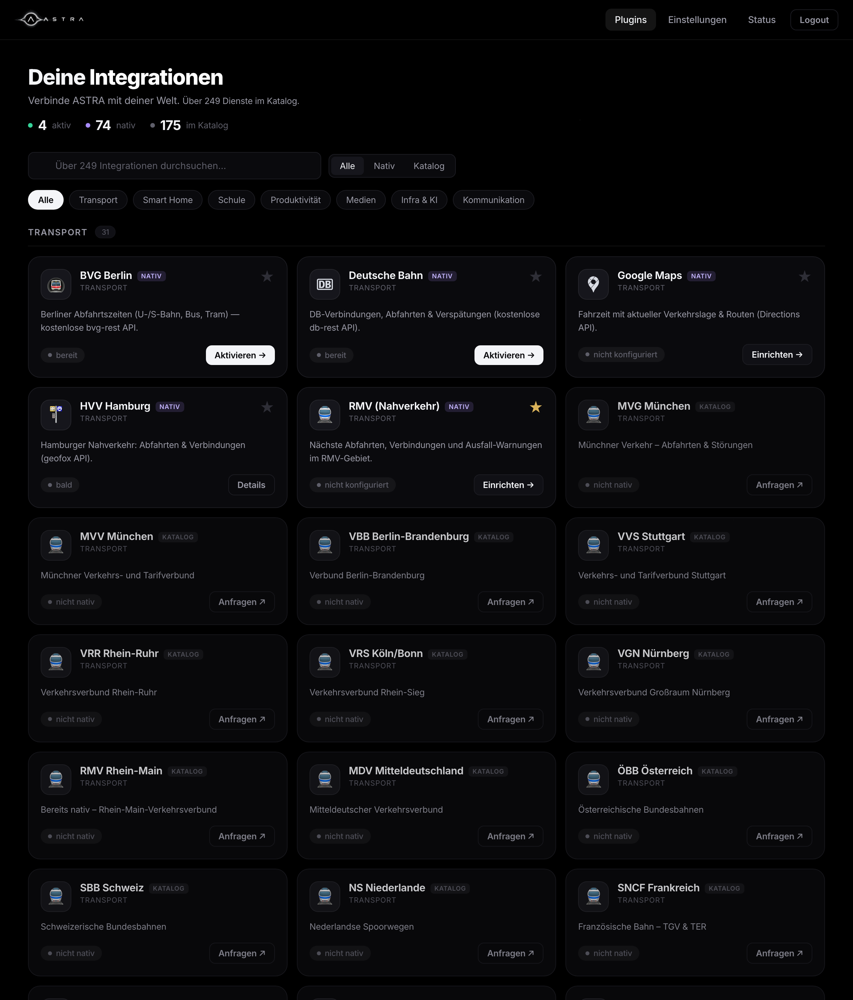
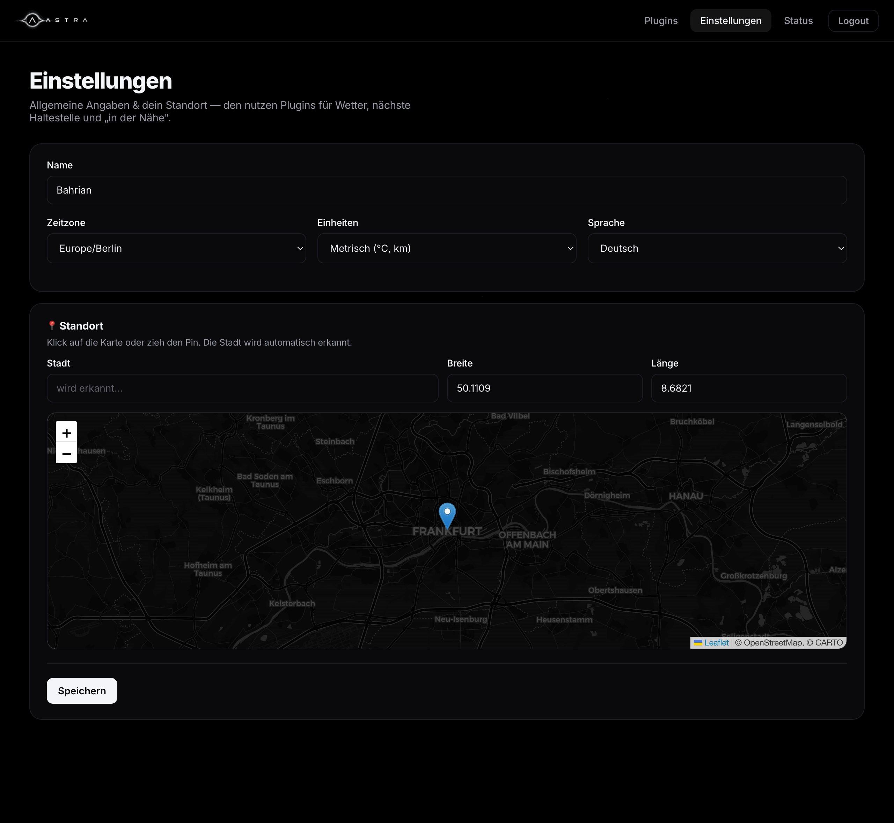
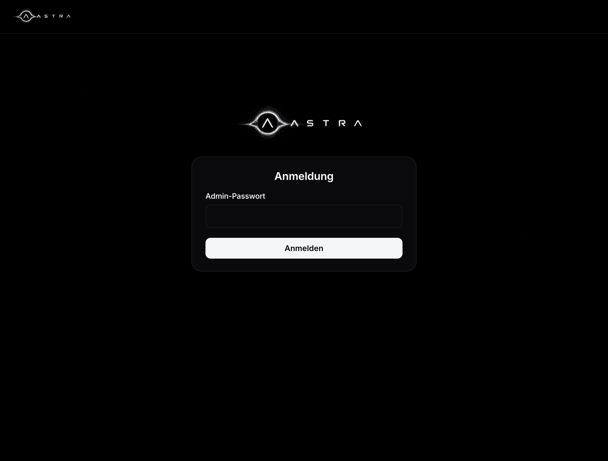

<div align="center">
  
  <p><em>Ein persönlicher KI-Agent, der auf deinem eigenen Server lebt.</em></p>
</div>

---

Stell dir einen Assistenten vor, der wirklich *dir* gehört. Er läuft zu Hause auf deinem
Server, liest deine Nachrichten über WhatsApp, Signal und Telegram, kennt deinen
Stundenplan und deine nächste Bahn, schaltet das Licht, merkt sich, was dir wichtig ist –
und fragt nach, bevor er etwas Wichtiges in deinem Namen tut. Keine fremde Cloud, keine
Datensammler. Dein Gehirn, dein Server, deine Regeln.

Das ist **ASTRA**.

> 🛠️ **Status:** Aktiv in Entwicklung – schon nutzbar, wächst täglich.

<div align="center">
  <br>
  <sub>Über 65 Integrationen – konfigurierbar in einer Weboberfläche, ganz ohne Neustart.</sub>
</div>

## ✨ Was ASTRA besonders macht

- **Eine Oberfläche für alles:** Ein OLED-schwarzes Web-Dashboard, in dem du Plugins
  durchsuchst, verbindest und ein-/ausschaltest – im Stil der Home-Assistant-Integrationen.
- **Über 65 Integrationen:** Verkehr, Smart Home, Messenger, Medien, Server & KI –
  von RMV und Deutsche Bahn über Home Assistant, Spotify und Proxmox bis zu lokalem Ollama.
- **Fragt, bevor es handelt:** Für heikle Aktionen meldet sich ASTRA per Telegram und
  wartet auf dein ✅ – Mensch bleibt in der Schleife.
- **Vergisst dich nicht:** Persona, Fakten und Routinen liegen als editierbare Dateien
  in einem Volume und überleben jedes Update.
- **Dein Standort, dein Kontext:** Setz einen Pin auf der Karte – Plugins wie Wetter
  und Nahverkehr wissen dann, wo „in der Nähe" ist.
- **Komplett selbst gehostet:** Deine Daten verlassen deinen Server nicht.

<div align="center">
  <br>
  <sub>Standort per Karte setzen – wie in Home Assistant.</sub>
</div>

## 🧩 Architektur

ASTRA setzt auf eine moderne, stark entkoppelte Docker-Architektur:

- **🧠 Cortex (Python/FastAPI):** Das zentrale Gehirn. Hier liegt die gesamte Geschäftslogik, das Gedächtnis, die Richtlinien (Policies) und die "Human-in-the-Loop"-Steuerung. Besitzt **allen** State.
- **⚙️ n8n:** Zustandslose Workflow-Engine. Beinhaltet keine Business-Logik, sondern stellt dem Cortex lediglich Tools und API-Schnittstellen (als Workflows, `tool/send_*`) zur Verfügung.
- **🗄️ PostgreSQL & pgvector:** Source of Truth (contacts, threads, messages, approvals, audit_log) + Vektorspeicher (Memory/Embeddings).
- **🔴 Redis:** State-Machine-Zustand der Threads, Deferral Timer und Pub/Sub-Events.
- **💬 Messenger-Gateways:**
  - **WAHA:** WhatsApp-Anbindung.
  - **Signal-CLI:** Signal-Anbindung.
  - **Telegram:** Haupt-Steuerkanal und Genehmigungs-Channel für den Besitzer.
- **👁️ Langfuse:** LLM-Tracing und Debugging für maximale Transparenz bei KI-Entscheidungen.
- **🌐 Caddy:** Reverse Proxy für sicheren TLS-Zugriff von außen.

## 🔁 Funktionsweise (Kurz)

```
Eingang (3. Person) ──► Triage (billiges LLM) ──► Policy ──► AUTO | DEFER | ASK
                                                              │
   AUTO  → ASTRA antwortet sofort (innerhalb der Freigabe-Stufe)
   DEFER → wartet ASTRA_DEFER_SECONDS auf DICH; sonst springt der Sweeper ein
   ASK   → Telegram-Nachricht an dich mit Buttons ✅ Ja / 🟡 Nur „beschäftigt“ / ❌ Nein
```

Antwortest du selbst (auch direkt vom Handy via WhatsApp `fromMe`), erkennt ASTRA das und **hält sich raus** (Stand-down).

## 🛠️ Installation & Setup

ASTRA ist für ein Self-Hosted Setup via Docker Compose ausgelegt (z. B. unprivilegierter Debian-LXC auf Proxmox). Voraussetzung: ein OpenAI-API-Key und ein Telegram-Bot (via @BotFather).

```bash
git clone https://github.com/ProfessorEngineergit/ASTRA.git
cd ASTRA

cp .env.example .env
nano .env                 # Secrets eintragen (siehe Kommentare in der Datei)

docker compose build
docker compose up -d
docker compose logs -f cortex
```

Erfolgreich, wenn die Logs zeigen:

```
astra.db   : Postgres pool ready.
astra.main : Deferral sweeper started.
astra.main : Telegram poller started (mode=poll).
```

> **Tipp:** Mit `ASTRA_TELEGRAM_MODE=poll` (Default) brauchst du keine öffentliche Domain (Caddy), um mit dem Bot zu interagieren — der Poller holt Updates aktiv ab.

### Health-Check

```bash
curl http://127.0.0.1:8088/health      # → {"status":"ok"}
```

## 🔑 .env — Pflichtfelder

| Variable | Wofür |
|----------|-------|
| `POSTGRES_PASSWORD` | DB-Passwort (stark wählen) |
| `CORTEX_SHARED_SECRET` | authentifiziert cortex ⇄ n8n und die `/ingress/*`-Webhooks |
| `OPENAI_API_KEY` | LLM |
| `TELEGRAM_BOT_TOKEN` | dein Bot (@BotFather) |
| `TELEGRAM_OWNER_CHAT_ID` | deine numerische ID (@userinfobot) |
| `N8N_ENCRYPTION_KEY` | n8n (min. 24 Zeichen) |
| `WAHA_API_KEY` | WhatsApp-HTTP-API |
| `SIGNAL_PHONE_NUMBER` | deine registrierte Signal-Nummer |

Tipp für starke Werte: `openssl rand -hex 32`. Die `.env` ist `git-ignored` und wird nie commited.

## 📡 Kanäle anbinden

- **Telegram** — `ASTRA_TELEGRAM_MODE=poll` (Default): kein öffentlicher Port nötig, der Poller in `app/main.py` holt Updates aktiv ab. Buttons/Callbacks für Freigaben funktionieren sofort.
- **WhatsApp (WAHA)** — WAHA pusht eingehende Nachrichten an `http://cortex:8000/ingress/waha` (inkl. `X-Astra-Secret`-Header, siehe compose). QR-Code zum Pairing: `http://127.0.0.1:3000` (Dashboard-Login aus `.env`).
- **Signal** — eingehende Nachrichten an `POST /ingress/signal`. signal-cli pusht nicht von selbst; siehe „Offene Punkte".

## 🚚 Sende-Backend: `direct` vs. `n8n`

`ASTRA_SEND_BACKEND` (Default `direct`):

- **`direct`** — cortex ruft WAHA/Signal-APIs selbst auf (`app/channels.py`). Nichts weiter nötig.
- **`n8n`** — cortex POSTet an `tool/send_*`-Workflows. Dann die JSON-Workflows aus [`n8n/tools/`](n8n/tools/) in n8n importieren & aktivieren (Anleitung dort). Telegram geht in beiden Fällen immer direkt (niedrige Latenz + Buttons).

## 🧠 Assistenten-Fähigkeiten

Alle optional, alle einzeln per `.env` aktivierbar. Nicht konfiguriert = no-op (cortex bootet trotzdem). Persönliche Tools sind **owner-only** — eine fremde Person, die dir schreibt, kann sie weder sehen noch auslösen.

| Fähigkeit | Aktivieren mit | Was ASTRA dann kann |
|-----------|----------------|---------------------|
| 🎤 **Sprachnachrichten** | `OPENAI_API_KEY` (+ `ASTRA_VOICE_TRANSCRIPTION=true`) | Telegram-Voice → Whisper-Transkript → normaler Flow |
| 🏠 **Home Assistant** | `HOME_ASSISTANT_BASE_URL` + `HOME_ASSISTANT_TOKEN` | Geräte/Settings aktiv schalten, Zustände lesen, „warum ist X offline?" |
| 🏫 **Stundenplan** | `EDUPAGE_SUBDOMAIN/USERNAME/PASSWORD` | heutigen/morgigen Stundenplan abrufen |
| 🚆 **ÖPNV (RMV)** | `RMV_API_KEY` (+ `RMV_HOME_STOP_ID`) | nächste Abfahrten + Ausfall-Warnungen |
| ✅ **Google Tasks** | `GOOGLE_TASKS_ENABLED=true` + n8n-Workflow | To-Dos anlegen |
| ☀️ **Morning Briefing** | `ASTRA_BRIEFING_ENABLED=true` | proaktiv morgens: Übernacht-Nachrichten + Stundenplan + Abfahrten via Telegram |

ASTRA kann sich außerdem per Tool `remember_fact` selbst dauerhafte Fakten/Routinen merken (landet in den Markdown-Files, s. u.).

### Diese Tools nutzt das LLM
`recall_memory`, `request_owner_approval` (immer) · `remember_fact`, `home_assistant_state`, `home_assistant_call`, `get_timetable`, `get_departures`, `add_google_task` (owner-only).

### 🗂️ Dauerhaftes, editierbares Gedächtnis (überlebt Updates)
Markdown-Files im Volume `brain_data` (gemountet unter `/srv/data`, **nicht** im Git): `persona.md`, `facts.md`, `routines.md`, `people.md`. Beim ersten Start mit Vorlagen befüllt (deine Routinen sind schon eingetragen). `git pull` / Image-Rebuilds fassen sie nie an. Direkt editieren:
```bash
docker compose exec cortex sh -c 'vi /srv/data/routines.md'   # oder: docker cp
```
Die mem0-Vektor-Erinnerungen liegen in Postgres (`postgres_data`) — ebenfalls update-fest.

### ☀️ Briefing testen (ohne auf 07:00 zu warten)
```bash
curl -s localhost:8088/briefing/preview -H "X-Astra-Secret: $CORTEX_SHARED_SECRET"   # nur Text
curl -X POST localhost:8088/briefing/run -H "X-Astra-Secret: $CORTEX_SHARED_SECRET"  # wirklich senden
```

### 📊 Dashboard
Status-GUI (read-only) unter **`http://127.0.0.1:8088/dashboard`** — aktive Threads, offene Freigaben, Audit-Log, welche Fähigkeiten live sind. Hinter VPN/Caddy halten.

## 🧩 Plugins & Web-Konfiguration

Integrationen sind **Plugins**, die du in einer Weboberfläche verwaltest — Stöbern,
Suchen, Filtern nach Kategorie, Favoriten (★), Ein/Aus-Schalter, Config-Formular und
„Verbindung testen" — **wie die Home-Assistant-Integrationssuche**. Konfiguration läuft
**live, ohne Container-Neustart**.

<div align="center">
  <br>
  <sub>Beim ersten Öffnen legst du ein Admin-Passwort fest – danach Login per Session-Cookie.</sub>
</div>

```
http://<server-ip>:8088/admin     # z. B. http://192.168.178.189:8088/admin
```

Standardmäßig im **lokalen Netzwerk** erreichbar (cortex bindet auf `0.0.0.0:8088`;
geschützt durch bcrypt-Login + Session-Cookie + Rate-Limit). Für reinen Localhost-Zugriff
den Port in `docker-compose.yml` auf `127.0.0.1:8088:8000` zurücksetzen und per
SSH-Tunnel zugreifen. **Nicht** ungeschützt ins Internet exponieren.

- **Erstes Öffnen → Setup-Wizard:** du legst ein Admin-Passwort fest (oder vorab via
  `ASTRA_ADMIN_PASSWORD`). Danach Login mit signiertem Session-Cookie.
- **Katalog:** alle Plugins als Karten mit Status (aktiv / aus / nicht konfiguriert),
  Suche, Kategorie-Chips, „nur Favoriten".
- **Plugin konfigurieren:** Formular aus dem Plugin-Schema, Secrets **verschlüsselt**
  (Fernet) und write-only (Anzeige „•••• gesetzt"), Toggle, „Verbindung testen".
- **Sicherheit:** Secrets at-rest verschlüsselt; jede Änderung + Login landet im
  `audit_log`; persönliche Plugin-Tools bleiben **owner-only** (Dritte sehen sie nie).

### Mitgelieferte Plugins (65 in 7 Kategorien)
Über **65 Integrationen** im Katalog, davon ~59 voll funktionsfähig:

- 🚆 **Transport:** RMV, Deutsche Bahn, BVG Berlin, Google Maps · *(HVV bald)*
- 🏠 **Smart Home:** Home Assistant, Philips Hue, Shelly, Tasmota, WLED, HomeKit · *(MQTT, Zigbee2MQTT bald)*
- 🏫 **Schule:** EduPage, Moodle · *(IServ bald)*
- ✅ **Produktivität:** Google Tasks/Kalender, GitHub, GitLab, Gitea, Todoist, Trello, Linear, Notion, Obsidian, Nextcloud, Mealie, Paperless-NGX, Bring!, Krypto · *(CalDAV bald)*
- 🎧 **Medien:** Wetter, RSS/News, Spotify, Jellyfin, Plex, YouTube, Last.fm, Pocket Casts, Readwise, Immich, Sonarr, Radarr
- 🧩 **Infra & KI:** Proxmox, Docker, Portainer, Uptime Kuma, Netdata, Grafana, Pi-hole, AdGuard, qBittorrent, Ollama, n8n · *(Vaultwarden bald)*
- 💬 **Kommunikation:** Telegram (Kern), Slack, Discord, Matrix, Mastodon, Gmail, IMAP, ntfy, Pushover, Gotify

Plugins mit „bald" sind im Katalog gelistet, aber noch nicht implementiert — sag ASTRA,
welches du priorisiert haben möchtest. Jedes neue = eine Datei (s. u.).

### Neues Plugin hinzufügen (für Entwickler)
Eine Datei in `cortex/app/plugins/builtin/` mit einer `Plugin`-Subklasse: `slug`,
`name`, `category`, `config_fields` (treibt Formular + Validierung) und die Hooks, die
du brauchst (`tools()`, `briefing_section()`, `background_tasks()`, `health_check()`).
Discovery, Web-Formular, Verschlüsselung und Tool-Registrierung passieren automatisch.
Vorbild: [`builtin/rmv.py`](cortex/app/plugins/builtin/rmv.py).

> `.env`-Variablen (HOME_ASSISTANT_*, RMV_* …) wirken weiter als **Fallback**; gesetzte
> Web-Werte haben Vorrang (Precedence: DB > .env > Default).

## 🔌 API-Endpoints (cortex)

| Methode | Pfad | Zweck |
|---------|------|-------|
| GET  | `/health` | Docker-Healthcheck |
| GET  | `/admin` | Plugin-Katalog + Konfiguration (Login) |
| GET  | `/dashboard` | Status-GUI (HTML) |
| POST | `/ingress/waha` | WhatsApp-Eingang (WAHA) |
| POST | `/ingress/signal` | Signal-Eingang |
| POST | `/ingress/telegram` | nur wenn `ASTRA_TELEGRAM_MODE=webhook` |
| POST | `/briefing/run` | Briefing jetzt senden |
| GET  | `/briefing/preview` | Briefing-Text rendern (nicht senden) |

`/ingress/*` und `/briefing/*` verlangen den Header `X-Astra-Secret: <CORTEX_SHARED_SECRET>`; `/admin*` ist passwortgeschützt.

## ✅ Tests

```bash
cd cortex
.venv/bin/python -m pytest -q       # oder: python3 -m pytest -q
```

## 👨‍💻 Tech-Stack

- **Backend:** Python 3.11+, FastAPI, Pydantic, Asyncpg
- **KI/LLM:** OpenAI (GPT-4o, Embeddings), Mem0, Langfuse
- **Infrastruktur:** Docker Compose, Caddy, PostgreSQL (+ pgvector), Redis, n8n

## 🩺 Troubleshooting

**`ModuleNotFoundError: app.main` bzw. `Could not import module "app.main"` nach Update**
Fast immer ist der `git pull` abgebrochen, weil lokal `docker-compose.yml` editiert wurde:
```
error: Your local changes to the following files would be overwritten by merge: docker-compose.yml — Aborting
```
Dann wurde `main.py` nie geholt und der Build nahm einen `CACHED` Layer ohne die Datei. Fix:
```bash
cd /opt/astra
git checkout -- docker-compose.yml      # lokale compose-Änderung verwerfen (Repo hat die Fixes)
git pull origin main
docker compose build cortex             # main.py ist jetzt da → Layer wird neu gebaut
docker compose up -d
docker compose logs -f cortex
```
Prüfen, dass die Datei wirklich im Image liegt: `docker compose run --rm cortex python -c "import app.main"`.

**`docker: command not found`** → Docker zuerst installieren: `curl -fsSL https://get.docker.com | sh`.

**Image-Pull bricht ab (TLS/connection reset, IPv6)** → wie in deinem Setup half:
`sysctl -w net.ipv6.conf.all.disable_ipv6=1 && systemctl restart docker && docker compose up -d`.

## 🧭 Offene Punkte / nächste Schritte

- **Signal-Eingang:** `signal-cli-rest-api` im `json-rpc`-Mode pusht keine Webhooks. Optionen: (a) ein n8n-Schedule-Workflow, der `GET {SIGNAL_BASE_URL}/v1/receive/{NUMBER}` pollt und jede Nachricht an `/ingress/signal` weiterreicht, oder (b) den nativen Empfangs-Websocket nutzen. Ausgang funktioniert bereits.
- **Kalender-Schreibzugriff:** der Briefing-/Konflikt-Flow (Klavier↔Astroclub) liest bereits Stundenplan & ÖPNV; ein `calendar_add`/CalDAV- oder Google-Calendar-n8n-Workflow als nächstes Tool ergänzt das aktive Umbuchen.
- **Verbleibende Katalog-Platzhalter:** CalDAV, HVV, IServ, MQTT, Vaultwarden und Zigbee2MQTT sind im Katalog gelistet, aber noch nicht implementiert (brauchen Libs/Auth, die noch fehlen) — als „bald" markiert.
- **Proxmox-Agent & RMV-Trip-Routing:** als weitere owner-only Tools nach demselben Muster (`plugins/builtin/` — eine Datei pro Plugin).

---

*Made with ❤️ from Bahrian — still building the future.*
